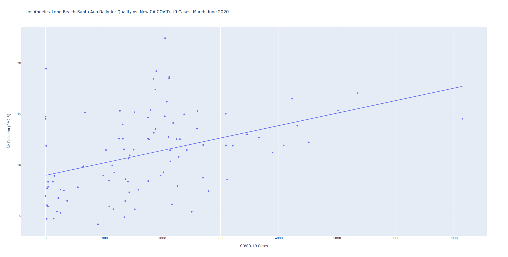

# Airborne

<p align="center">
	
</p>

Airborne is a data analysis tool for studying potential relationships between the COVID-
19 pandemic and air quality in the US. Using case data from [The COVID Tracking Project](https://covidtracking.com/data/api) and particulate matter (PM2.5) readings from [OpenAQ](https://docs.openaq.org/), Airborne visualizes and evaluates associations between a US state's new daily cases and air quality in its most polluted city.

11 states are currently supported with data spanning a time frame of March 1st to June 30th, 2020.

## Prerequisites 
Airborne is written in [Python 3](https://www.python.org/downloads/), so make sure to have a version of it installed! Airborne also relies on the following Python packages:

1. [pandas](https://pandas.pydata.org/)
2. [Plotly](https://plotly.com/)
3. [SciPy](https://www.scipy.org/)

You can install these packages via pip using the following command:
```pip install pandas plotly scipy```

## Directions
1. Download the repository as a ZIP file and extract it to your desired location.
2. Open a terminal window and navigate to the unzipped Airborne directory.
3. Run the following command:
```python3 airborne.py```
4. Use the GUI to download and analyze data.
	- Visualizations will open in your web browser.
	- Regression analysis results are stored in ```results.txt.```
	- API data is stored in ```airborne_database.db.``` You may use a program like [DB Browser for SQLite](https://sqlitebrowser.org/) to view the data.

## License
[MIT](https://choosealicense.com/licenses/mit/)